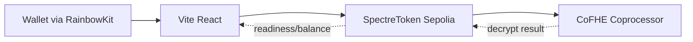

# Spectre Finance 👻

**Privacy-preserving DeFi protocol using CoFHE (Confidential FHE) on Sepolia**


## 🚀 Live Demo

- **Website:** https://spectrefinance.vercel.app
- **Contract (Sepolia):** [`0x751111805C4c8a014da9f040199d040788d61347`](https://sepolia.etherscan.io/address/0x751111805C4c8a014da9f040199d040788d61347) (SpectreToken V7)

---

## Overview

Spectre Finance allows users to:
- **Deposit ETH** → Receive encrypted seETH balance
- **Transfer privately** → Move encrypted balances without revealing amounts
- **Withdraw securely** → Async decryption via CoFHE coprocessor

Unlike traditional mixers, Spectre uses **Fully Homomorphic Encryption (FHE)** via Fhenix CoFHE to allow smart contracts to compute on encrypted data without ever decrypting it.

---

## 🏗️ Architecture

```
┌─────────────────────────────────────────────────────────────────────────┐
│                              USER                                        │
│               (MetaMask / Rainbow / Coinbase / WalletConnect)            │
└─────────────────────────────┬───────────────────────────────────────────┘
                              │
                              ▼
┌─────────────────────────────────────────────────────────────────────────┐
│                       FRONTEND (Vite + React)                           │
│  ┌─────────────┐  ┌─────────────┐  ┌─────────────┐  ┌───────────────┐  │
│  │   Mint UI   │  │ Transfer UI │  │   Burn UI   │  │ Privacy Guard │  │
│  └─────────────┘  └─────────────┘  └─────────────┘  └───────────────┘  │
│                              │                                          │
│                      cofhejs SDK                                        │
└─────────────────────────────┬───────────────────────────────────────────┘
                              │
                              ▼
┌─────────────────────────────────────────────────────────────────────────┐
│                 SPECTRETOKEN (FHERC20) CONTRACT (Sepolia)               │
│  ┌─────────────┐  ┌─────────────┐  ┌─────────────┐  ┌───────────────┐  │
│  │   mint()    │  │ transfer()  │  │ requestBurn │  │  claimETH()   │  │
│  │             │  │             │  │    All()    │  │               │  │
│  └─────────────┘  └─────────────┘  └──────┬──────┘  └───────┬───────┘  │
│                                           │                  │          │
│              mapping(address => euint128) _balances          │          │
└───────────────────────────────────────────┼──────────────────┼──────────┘
                                            │                  │
                                            ▼                  │
┌─────────────────────────────────────────────────────────────────────────┐
│                      CoFHE COPROCESSOR (Off-chain)                      │
│                                                                         │
│    FHE.decrypt() ──────► Threshold Decryption ──────► getDecryptResult │
│                              (~30 seconds)                              │
└─────────────────────────────────────────────────────────────────────────┘
```

### Flow Summary

1. **Mint:** User sends ETH via `mint()` → Contract encrypts as `euint128` → Stored in `_balances` mapping → User receives seETH
2. **Transfer:** Encrypted amount moved between users via `transfer()` (no one sees the amount)
3. **Burn (Withdraw):** 
   - Step 1: `requestBurnAll()` or `requestBurnPlain()` triggers `FHE.decrypt()` → sent to CoFHE coprocessor
   - Step 2: Wait ~30 seconds for threshold decryption
   - Step 3: `claimETH()` retrieves result via `getDecryptResultSafe()` → ETH sent to user

### DApp architecture

**Stack:** User (RainbowKit multi-wallet) → Frontend (Vite + React, Sepolia) → SpectreToken FHERC20 (Sepolia) → CoFHE coprocessor (off-chain decryption).

**Frontend:**
- **Page:** `SpectrePage` (main app).
- **Components:** `HeaderBar` (logo, connect, theme), `HeroBlock` (tagline, badges), `EncryptDecryptCard` (Mint / Transfer / Burn tabs, amount inputs, steps, Sync balance, claim).
- **Hooks:** `useWallet` (RainbowKit/wagmi — connect, chainId, switch network), `useTheme`, `useCofhe` (optional: encrypt/unseal for fully private transfer).
- **Config:** `config.ts` (Sepolia, contract addresses), `fherc20-abi.ts` (SpectreToken ABI).

**Data flows:**
- **Mint:** ETH → `mint()` → contract stores encrypted in `_balances`, updates indicated balance → Transfer(0, user, 0.0001) for wallets.
- **Transfer:** `transferPlain(to, amount)` (or encrypted `transfer(to, InEuint128)` with cofhejs) → encrypted and indicated balances updated.
- **Sync balance:** `requestBalanceDecryption()` → CoFHE decrypts `_balances[user]` → frontend polls `getDecryptedBalance()` → result stored in localStorage and shown in UI.
- **Burn:** `requestBurnPlain` / `requestBurnAll` → contract stores request and calls `FHE.decrypt()` → CoFHE decrypts off-chain → frontend polls `isWithdrawalReady()` → user calls `claimETH()` to receive ETH.



---

## ⚡ Quick Start (1 Minute)

### Prerequisites
- Any EVM wallet — MetaMask, Rainbow, Coinbase Wallet, or WalletConnect-compatible ([Get Sepolia ETH from faucet](https://sepoliafaucet.com))
- Node.js 18+

### Try the Live App

1. Go to https://spectrefinance.vercel.app
2. Click **CONNECT** and pick your wallet (switch to Sepolia network)
3. Enter an amount and click **MINT seETH**
4. Confirm the transaction in your wallet
5. Your ETH is now encrypted as seETH! ✨

### What You Should See

- **Before:** ETH balance decreases, seETH balance increases
- **Encrypt:** Transaction confirmed, balance shows encrypted amount
- **Decrypt:** Request → Wait 30s → Claim button enables → ETH returned

---

## 🔐 Security & Privacy

### What IS Private

| Data | Privacy Level | Details |
|------|---------------|---------|
| **Individual Balances** | 🔒 Fully Encrypted | Stored as `euint128`, only owner can decrypt |
| **Transfer Amounts** | 🔒 Hidden | No one can see how much was transferred |
| **Failed Transfers** | 🔒 Indistinguishable | Failed transfers look identical to successful ones |

### What is NOT Private (Metadata Leakage)

| Data | Visibility | Mitigation |
|------|------------|------------|
| **Deposit Amount** | 🔓 Public on-chain | Use randomized amounts (Privacy Guard helps) |
| **Withdrawal Amount** | 🔓 Revealed at claim | Inherent to async decryption |
| **Transaction Timing** | 🔓 Public | Space out transactions |
| **Sender/Receiver** | 🔓 Public addresses | Use fresh wallets |
| **TVL (Total Value)** | 🔓 Public | By design for transparency |

### Trust Assumptions

| Component | Trust Level | Notes |
|-----------|-------------|-------|
| **CoFHE Coprocessor** | Trusted | Threshold decryption requires honest majority |
| **Fhenix Network** | Trusted | Provides FHE infrastructure |
| **Smart Contract** | Auditable | Code is verified on Etherscan |
| **Frontend** | Trustless | Open source, can self-host |

### Known Limitations

1. **Async Decryption Delay:** ~30 seconds wait for CoFHE to process
2. **No Withdrawal Timeout:** If decryption fails, funds may be locked (emergency recovery planned)
3. **Deposit Amount Visible:** The ETH amount you mint is public; only seETH transfers are private
4. **Round Number Leakage:** Depositing exactly 1.0 ETH leaks information (use Privacy Guard)

---

## 🛠️ Development Setup

### 1. Clone & Install

```bash
git clone https://github.com/Snehal707/spectre-finance.git
cd spectre-finance

# Install contract dependencies
npm install

# Install frontend dependencies
cd frontend && npm install
```

### 2. Configure Environment

```bash
# Copy example env file
cp env.example .env

# Edit .env with your values:
# PRIVATE_KEY=your_wallet_private_key
# SEPOLIA_RPC_URL=https://rpc.sepolia.org
```

### 3. Run Tests

```bash
npm test
```

### 4. Deploy Contract

```bash
# Deploy to Sepolia (primary)
npm run deploy:sepolia

# Or Arbitrum Sepolia (lower gas)
npm run deploy:arb-sepolia

# Or Base Sepolia
npm run deploy:base-sepolia
```

### 5. Run Frontend

```bash
cd frontend
npm run dev
```

---

## 📁 Project Structure

```
spectre-finance/
├── contracts/
│   ├── SpectreToken.sol          # FHERC20 token (V7 - Redact-style balanceOf)
│   └── SpectreVault.sol          # FHE vault (legacy V3)
├── scripts/
│   └── deploy.js                 # Deployment script
├── test/
│   └── SpectreVault.test.js      # Contract tests
├── frontend/
│   ├── src/
│   │   ├── pages/
│   │   │   └── SpectrePage.tsx       # Main app page (boot, parallax, layout)
│   │   ├── components/
│   │   │   ├── HeaderBar.tsx         # Logo, wallet connect, theme toggle
│   │   │   ├── HeroBlock.tsx         # Hero tagline, feature badges
│   │   │   ├── EncryptDecryptCard.tsx # Mint / Transfer / Burn flow
│   │   │   ├── AmountPanel.tsx       # Amount input with token badge
│   │   │   ├── PercentSlider.tsx     # Percentage slider
│   │   │   ├── PrivacyGuard.tsx      # AI warning for round numbers
│   │   │   └── ui/                   # Reusable UI kit (Button, Card, Input, Tabs, etc.)
│   │   ├── hooks/
│   │   │   ├── useCofhe.ts           # FHE SDK integration
│   │   │   ├── useWallet.ts          # RainbowKit/wagmi wallet hook
│   │   │   └── useTheme.ts           # Dark/light theme toggle
│   │   ├── utils/
│   │   │   ├── wagmi.ts              # RainbowKit + wagmi config
│   │   │   ├── config.ts             # Network & contract addresses
│   │   │   └── fherc20-abi.ts        # SpectreToken ABI
│   │   └── index.css                 # Tailwind v4 theme tokens & cyberpunk utilities
│   └── package.json
├── .github/
│   └── workflows/
│       └── ci.yml                # Compile, lint, build on push
├── hardhat.config.js
├── env.example
└── package.json
```

---

## 📜 Smart Contracts

### SpectreToken.sol (FHERC20) - **Deployed V7**

**Address:** `0x751111805C4c8a014da9f040199d040788d61347`

A true **FHERC20** token with full ERC20 compatibility and encrypted balances. Uses a **Redact-style** pattern: `balanceOf()` returns an indicated balance (0.0001–0.9999) so MetaMask and wallets display sane numbers, while real amounts stay encrypted.

| FHERC20 Feature | Function |
|-----------------|----------|
| **Token Metadata** | `name()`, `symbol()`, `decimals()` |
| **Wallet Balance** | `balanceOf(address)` → `uint256` (indicated, wallet-friendly) |
| **Encrypted Balance** | `encryptedBalanceOf(address)` → `euint128` (app-only) |
| **Indicated Balance** | `indicatedBalanceOf(address)` → `uint256` |
| **Private Transfer** | `transfer(to, InEuint128)` |
| **Plain Transfer** | `transferPlain(to, amount)` |
| **Approve/Allowance** | `approve()`, `allowance()`, `transferFrom()` |
| **Mint (ETH→seETH)** | `mint()` payable |
| **Burn (seETH→ETH)** | `requestBurnAll()`, `requestBurnPlain()` |
| **Claim ETH** | `claimETH()` after CoFHE decryption |
| **View Balance** | `requestBalanceDecryption()`, `getDecryptedBalance()` |

### SpectreVault.sol (Legacy V3)

**Address:** `0x7e3188bdB5DcE28735274389013d3b0194BDfA84`

Original vault-style contract (kept for backwards compatibility).

### Key FHE Patterns

| Pattern | Description |
|---------|-------------|
| `euint128` | Encrypted 128-bit integers for balances |
| `ENCRYPTED_ZERO` | Gas-optimized constant |
| `FHE.select()` | No-branching conditional logic |
| `FHE.allowThis/Sender()` | Proper access control |
| Async Decryption | Two-step withdrawal (request → claim) |

### Events

```solidity
event Transfer(address indexed from, address indexed to, uint256 value);  // value = 0.0001 for MetaMask
event Approval(address indexed owner, address indexed spender);
event Mint(address indexed to);
event Burn(address indexed from);
event WithdrawalRequested(address indexed user);
event WithdrawalClaimed(address indexed user);
```

---

## 🎨 Frontend Features

- 🌓 **Dark/Light Theme** — Cyberpunk aesthetic with scanline overlays, cyber-grid, and clipped corners
- 🌈 **RainbowKit Multi-Wallet** — MetaMask, Rainbow, Coinbase Wallet, WalletConnect
- 🖥️ **SystemBoot Sequence** — Terminal-style startup animation (once per session)
- ⚡ **SuccessEffect** — Full-screen white-out flash with per-action messages (Mint/Transfer/Burn)
- 🔒 **Privacy Mode** — Encrypted balance display
- 🤖 **Privacy Guard** — AI warns about round number deposits
- 📋 **Transaction History** — Recent activity from localStorage with explorer links
- 🏷️ **Feature Badges** — Modular Frame design with glowing accents
- 📦 **AlertFrame System** — Tactical data-frame alerts (success/warn/error/info) with theme-aware text
- 📱 **Responsive** — Works on desktop and mobile
- ⏳ **Pending State UX** — Visual progress for 30s decrypt wait
- 🦊 **Wallet Compatible** — Indicated balance + Transfer events for wallet display

---

## 🌐 Supported Networks

| Network | Chain ID | Status |
|---------|----------|--------|
| **Ethereum Sepolia** | 11155111 | ✅ Full support (contract deployed) |
| **Arbitrum Sepolia** | 421614 | ⚙️ Config only (no contract deployed) |
| **Base Sepolia** | 84532 | ⚙️ Config only (no contract deployed) |

---

## 📚 Resources

- [Fhenix CoFHE Documentation](https://cofhe-docs.fhenix.zone)
- [cofhe-hardhat-starter](https://github.com/fhenixprotocol/cofhe-hardhat-starter)
- [cofhejs GitHub](https://github.com/FhenixProtocol/cofhejs)
- [CoFHE Contracts GitHub](https://github.com/FhenixProtocol/cofhe-contracts)

---

## ⚠️ Disclaimer

**THIS SOFTWARE IS PROVIDED "AS IS" WITHOUT WARRANTY OF ANY KIND.**

- This is experimental software using cutting-edge cryptography (FHE)
- Smart contracts have NOT been audited by a third party
- Use only on testnets or with amounts you can afford to lose
- The CoFHE coprocessor is a trusted component in the security model
- Async decryption failures may result in locked funds

**Do not use in production without proper security audits.**

---

## 📄 License

MIT License - see [LICENSE](LICENSE) file.

---

## 🙏 Credits

Built with:
- **Fhenix Protocol** — CoFHE infrastructure
- **Official Fhenix Tools** — cofhe-hardhat-plugin, cofhe-contracts
- **RainbowKit** — Multi-wallet connection modal
- **wagmi + viem** — React hooks for Ethereum
- **Redact Money** — UI inspiration
